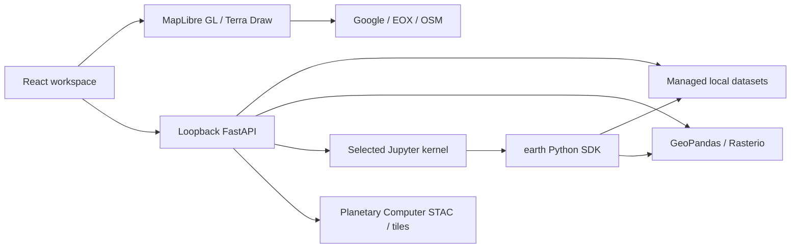

# Architecture

## Responsibilities

- `src/App.tsx`: user workflow and contextual UI. Operation forms emit a Python equivalent and run the shared API operation. Imported and generated datasets share layer IDs.
- `src/MapWorkspace.tsx`: MapLibre camera/projection, tiled basemaps, raster/vector layers, Terra Draw polygon editing, and Turf measurement. MapLibre's worker is bundled with Vite's `?worker&url`; copying only its URL leaves shared imports unresolved and prevents vectors from rendering. The former Cesium renderer remains inactive in `src/Globe.tsx`.
- `server/main.py`: loopback security boundary, upload/path import, raster tiles, catalog requests, Python kernels, and provider sessions.
- `server/processing.py`: CRS-aware geospatial operations with new outputs and resource limits. Local and catalog rasters share processing paths; eligible rendered basemaps support an explicit, tile-limited Clip operation, not general analytical-band processing.
- `server/sdk.py`: `earth.layers()`, `earth.path(id)`, `earth.assets(id)`, `earth.run(...)`, and `earth.add(path)` inside the selected Python environment.

## Persistence and execution

Metadata and normalized local datasets live under `.earth/datasets/<id>`. A completed output is registered only after its file is written. Workspace view state is explicitly saved to browser localStorage. Kernels are separate local processes and serialize cell execution; GUI jobs currently use FastAPI worker threads in the service environment.

Notebook `ds` and `dfs` bindings are independent lazy viewport copies. Explicit visualization creates a new dataset; ordinary notebook edits do not overwrite map layers. Raster copies retain native pixel resolution, while vector visualization copies are bounded to 5,000 features. Local datasets, notebook state, environments, and research outputs are excluded from Git.

The browser and local API are served from one origin. No user registration, remote relay, or hosted compute is needed. External data requests still need network access and follow provider terms.

## Next architectural work

Extract the growing UI panels into focused components, introduce a versioned project/workflow model, unify GUI job dispatch with selected kernels, and add cancellable resource-bounded worker jobs before supporting large data or training. Extend format adapters explicitly rather than advertising arbitrary-format support. Add authenticated native packaging and stricter sandboxing if the trust model changes.